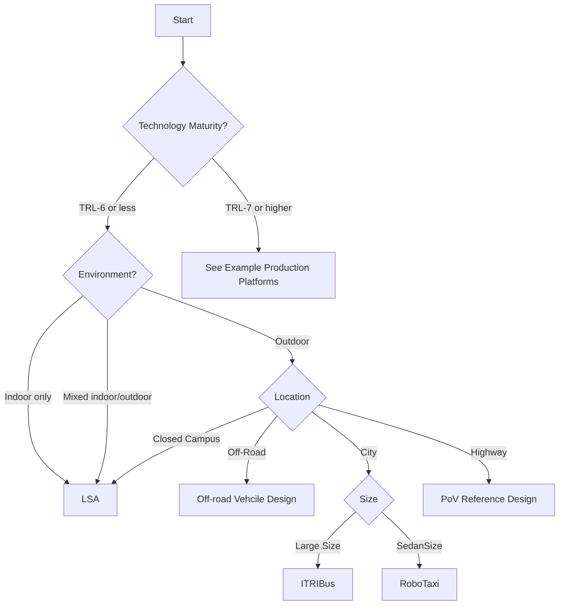

# Find Your Reference Design

Use the decision flowchart to identify which reference configuration matches your deployment scenario, then explore real-world examples that demonstrate each configuration.

## Decision Flowchart

---

## Reference Configurations

These are conceptual configurations optimized for different deployment scenarios. Each defines recommended components, performance targets, and ODD coverage.

| Configuration | Best For | Environment | Localization | Key Feature |
|---------------|----------|-------------|--------------|-------------|
| [Campus](build-examples.md#campus-configuration) | Standard outdoor deployment | Paved, GPS available | RTK GNSS | Balanced cost/capability |
| [Indoor](build-examples.md#indoor-configuration) | Warehouse, factory | GPS-denied | LiDAR SLAM + markers | No GNSS dependency |
| [High-Performance](build-examples.md#high-performance-configuration) | Research, complex scenarios | Any | GNSS + SLAM fusion | Maximum capability |
| [Budget](build-examples.md#budget-configuration) | Prototyping, simple routes | Paved, GPS available | Single GNSS | Cost-optimized |
| [Compact](build-examples.md#compact-configuration) | Small vehicles | Indoor/outdoor | Camera SLAM | Space-constrained |

For detailed component specifications, see [Design Choices by Example](build-examples.md).

---

## Real World Examples by Configuration

### Campus Configuration

These production deployments demonstrate the Campus configuration in action:

#### TalTech iseAuto

Campus shuttle at Tallinn University of Technology, Estonia.

| Aspect | Details |
|--------|---------|
| **Platform** | Custom electric shuttle |
| **Sensors** | 3D LiDARs, automotive cameras, GNSS/IMU |
| **Connectivity** | Private 5G network |
| **Status** | Regular public transport service on campus |

**Software Stack:**

| Component | Details |
|-----------|---------|
| **Autoware** | Autoware.universe |
| **Architecture** | [ISEAUTO Paper (PDF)](https://www.researchgate.net/journal/International-Journal-of-Artificial-Intelligence-and-Machine-Learning-2642-1585/publication/339274779_Autonomous_Last_Mile_Shuttle_ISEAUTO_for_Education_and_Research/links/6572efddfc4b416622a8247f/Autonomous-Last-Mile-Shuttle-ISEAUTO-for-Education-and-Research.pdf) |

**Highlights:** First self-driving vehicle in Estonia; Level 4 shuttle built in one year using Autoware; V2X and teleoperation research platform.

**Links:** [iseAuto Project](https://autolab.taltech.ee/portfolio/iseauto/) | [TalTech Autoware Foundation](https://autoware.org/autowareio/taltech/)

---

#### NC A&T Aggie Auto

Autonomous GEM shuttles at North Carolina A&T State University.

| Aspect | Details |
|--------|---------|
| **Platform** | GEM e6 electric vehicles |
| **Sensors** | Multi-sensor LiDAR suite, NovAtel GNSS with dual antennas |
| **Drive-by-wire** | AutonomouStuff PACMod |
| **Status** | Public pilot program completed |

**Software Stack:**

| Component | Details |
|-----------|---------|
| **Autoware** | Autoware (open source) |
| **Integration** | AutonomouStuff Speed and Steering Control (SSC) |

**Highlights:** SAE Level 4 autonomy; connected autonomous vehicle (CAV) testbed; 2-mile rural test track; public service connecting campus to downtown Greensboro.

**Links:** [Aggie Auto Project](https://www.aggieauto.com/about) | [AutonomouStuff Case Study](https://autonomoustuff.com/products/case-studies/nc-a-and-t-state-university-autonomous-gem-shuttles)

---

#### KingWayTek Micro LSV

Micro self-driving vehicles deployed in Taiwan for passenger transport and cargo delivery.

| Aspect | Details |
|--------|---------|
| **Platform** | Custom micro EV (3380×1350×1850mm) |
| **Max Speed** | ≤15 km/h |
| **Autonomy Level** | L4 |
| **Capacity** | 4-5 passengers or 350kg cargo |
| **Range** | 50km |

**Technology Stack:**

| Component | Details |
|-----------|---------|
| **Sensors** | LiDAR, radar, cameras |
| **Maps** | HD Maps (centimeter-level precision) |
| **Communication** | C-V2X (4G/5G) |

**Highlights:** First Taiwan Lantern Festival self-driving vehicle (2024); 400 trips serving 1,000+ passengers in 16 days; deployed at 13+ locations including TSMC Southern Taiwan Science Park.

**Links:** [KingWayTek](https://www.kingwaytek.com/eng/index.html) | [Self-Driving Solutions](http://smartdriving.kingwaytek.com/en/index.html) | [Introduction (PDF)](../KWT_LSV/Kingway_LSV_introduction_ENG_0729AWF_v1.pdf)

---

### Development Platforms

These platforms are designed for algorithm development, education, and prototyping:

#### Go-Kart (1/3 Scale)

Human-rideable platform for software development and testing, developed by the Autoware Center of Excellence at University of Pennsylvania.

| Component | Choice |
|-----------|--------|
| **Platform** | TopKart chassis |
| **ECU** | x86 laptop + NVIDIA GPU |
| **LiDAR** | Ouster OS1 |
| **Camera** | OAK-D (depth + on-device AI) |
| **GNSS** | RTK-GNSS |

**Software Stack:**

| Component | Details |
|-----------|---------|
| **ROS 2** | Foxy / Humble |
| **Control** | Pure Pursuit, MPC |
| **Sensor Code** | [gokart-sensor](https://github.com/mlab-upenn/gokart-sensor) |
| **MCU Code** | [gokart-mechatronics](https://github.com/mlab-upenn/gokart-mechatronics) |

**Best For:** Algorithm development, SAE Level 0-3 testing

**Documentation:** [Go-Kart Details](./GoKart/index.md) | [Project Docs](https://go-kart-upenn.readthedocs.io/) | [GitHub](https://github.com/mlab-upenn/Go-Kart)

---

#### RoboRacer (1/10 Scale)

Lowest-cost entry point for learning autonomy.

| Component | Choice |
|-----------|--------|
| **Platform** | Traxxas Slash 4x4 |
| **ECU** | Jetson Xavier NX |
| **LiDAR** | Hokuyo UTM-30LX (2D) |
| **Camera** | ZED 2 or RealSense (optional) |
| **Motor Control** | VESC 6 MK III |

**Software Stack:**

| Component | Details |
|-----------|---------|
| **ROS 2** | Foxy |
| **Simulator** | [RoboRacer Gym](https://github.com/f1tenth/f1tenth_gym) |
| **Source Code** | [GitHub](https://github.com/f1tenth) |

**Best For:** Education, racing competitions, algorithm prototyping

**Documentation:** [RoboRacer Details](./RoboRacer/index.md) | [RoboRacer Portal](https://roboracer.ai/) | [RoboRacer Learn](https://roboracer.ai/learn)

---

#### AutoSDV

Home-buildable 1/10 scale platform with comprehensive documentation, developed by NEWSLab at National Taiwan University.

| Model | LiDAR | Localization | Connectivity |
|-------|-------|--------------|--------------|
| Base | None (camera only) | Vision only | Standard |
| 360° LiDAR | Velodyne VLP-32C | NDT (full autonomous) | Standard |
| Solid-State | Seyond Robin-W (150m) | Development needed | Standard |
| Connected | Seyond Robin-W | Development needed | 5G (Ataya/MOXA) |

**Core Platform:** Jetson AGX Orin 64GB, ZED X Mini stereo camera, Tekno TKR9500 chassis

**Software Stack:**

| Component | Details |
|-----------|---------|
| **Autoware** | Autoware.universe |
| **ROS 2** | Humble |
| **Source Code** | [GitHub](https://github.com/NEWSLabNTU/AutoSDV) |

**Best For:** Self-learners, home projects, university courses

**Documentation:** [AutoSDV Details](./AutoSDV/index.md) | [AutoSDV Book](https://newslabntu.github.io/autosdv-book/) | [GitHub](https://github.com/NEWSLabNTU/AutoSDV)

---

## Decision Criteria Reference

Use these tables to refine your configuration choice based on specific requirements.

### By Environment

| Your Environment | Recommended Configuration |
|------------------|---------------------------|
| Outdoor, paved, GPS available | Campus or Budget |
| Indoor, structured, GPS-denied | Indoor |
| Mixed indoor/outdoor | Compact or High-Performance |

### By Speed Requirement

| Target Speed | Recommended Configuration |
|--------------|---------------------------|
| <5 kph | Indoor, Compact |
| 5-10 kph | Budget, Campus |
| 10-15 kph | Campus, High-Performance |
| >15 kph | High-Performance (research only) |

### By Budget

| Budget Level | Recommended Configuration |
|--------------|---------------------------|
| Limited | Budget |
| Moderate | Campus |
| Flexible | High-Performance |

---

## Other Example Designs

For detailed documentation on specific platforms:

- [RoboRacer](./RoboRacer/) - Racing robots using Autoware
- [Go-Kart](./GoKart/) - EV Go-Kart using Autoware
- [AutoSDV](./AutoSDV/) - Home-buildable platform
- [KWT LSV (PDF)](../KWT_LSV/Kingway_LSV_introduction_ENG_0729AWF_v1.pdf) - Micro self-driving vehicles by KingWayTek
- [System Configuration](../system-configuration/index.md) - Hardware and software components for LSA vehicles

---

## Next Steps

- Review [Design Choices by Example](build-examples.md) for detailed component specifications
- Explore [Hardware Configuration](../hardware-configuration/index.md) for ECU and sensor options
- Follow [Software Configuration](../software-configuration/index.md) for setup guides
