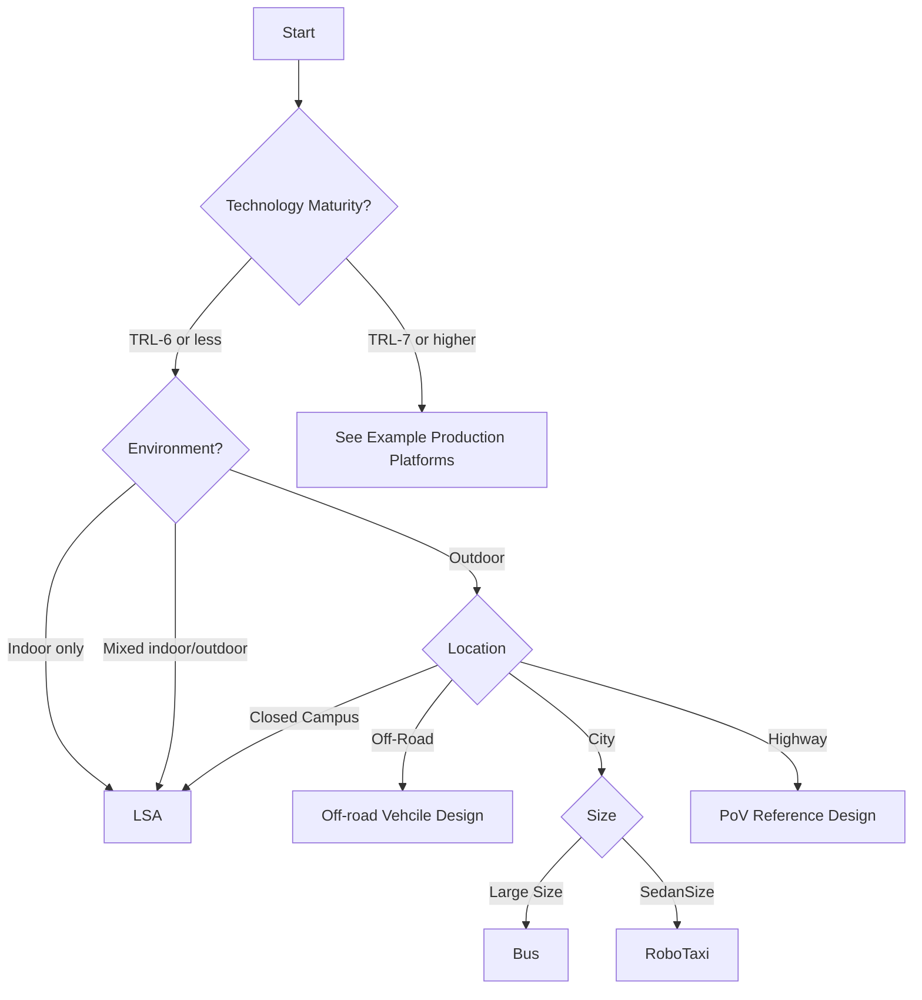

# Find Your Reference Design

Use the decision flowchart to identify which reference configuration matches your deployment scenario, then explore real-world examples that demonstrate each configuration.

## Decision Flowchart

---

## Example Production Platforms
| Configuration | Best For | Environment | Localization | Key Feature |
|---------------|----------|-------------|--------------|-------------|
| [KingWayTek Micro LSV]() | Mixed traffic flows and low budget | Paved, GPS available | RTK GNSS | Balanced cost/capability |
| [Bus](./itri-bus/) | Shuttle Services for fixed route | Paved, GPS available | RTK GNSS | Comfortable and safe ride |
| [RoboTaxi]() | Point-to-Point On-Demand Services | Paved, GPS available | RTK GNSS | Comfortable and safe ride |

## Reference Conceptual Design Guidelines

These are conceptual configurations optimized for different deployment scenarios. Each defines recommended components, performance targets, and ODD coverage.

| Configuration | Best For | Environment | Localization | Key Feature |
|---------------|----------|-------------|--------------|-------------|
| [LSA]([build-examples.md#campus-configuration](https://autowarefoundation.github.io/LSA-reference-design-docs/main/)) | Mixed traffic flows and low budget | Paved, GPS available | RTK GNSS | Balanced cost/capability |
| [PoV]([build-examples.md#indoor-configuration](https://autowarefoundation.github.io/autoware.pov-reference-design-docs/main/)) | Highway |  Paved, GPS available | RTK GNSS | End-to-End Machine Learning Pipeline |
| [Off-road]() | Racing, education, and research | Unpaved, GPS available | Single GNSS | No map and AI-enabled |
| [Trunk]() | Heavy duty vehicles | Outdoor | RTK GNSS |  |
| [Racier]() | Racing and Education | Indoor tracks | No | Racing robots using Autoware |
| [Go-Kart]() | Racing and Development | Outdoor | RTK GNSS |  EV Go-Kart using Autoware |

